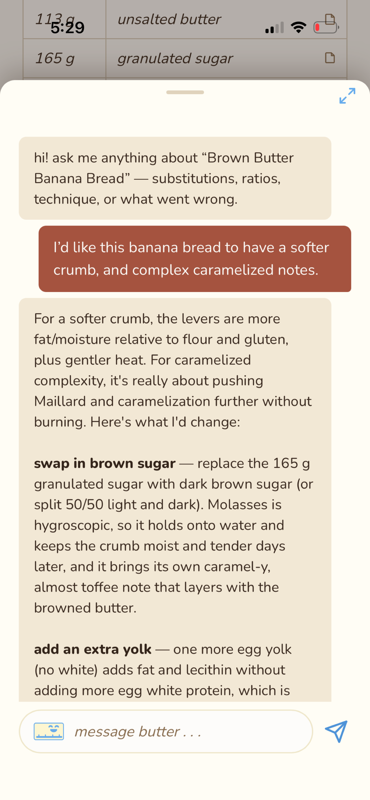
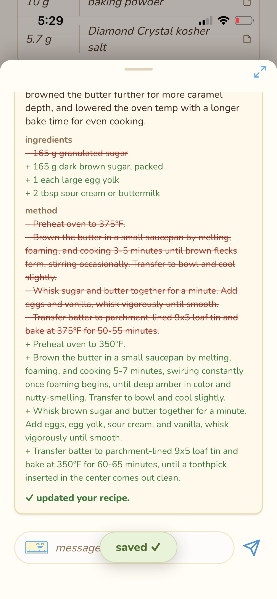
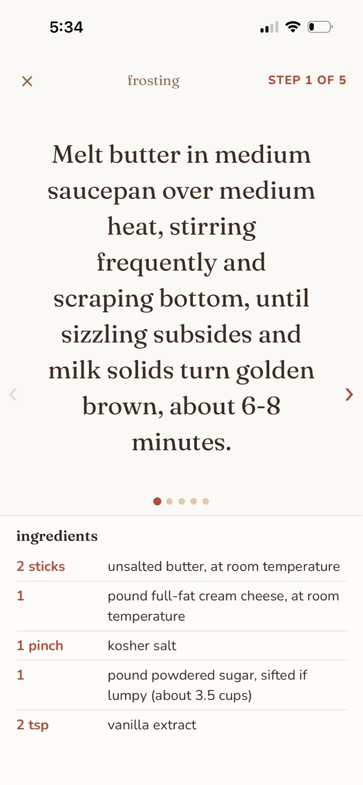
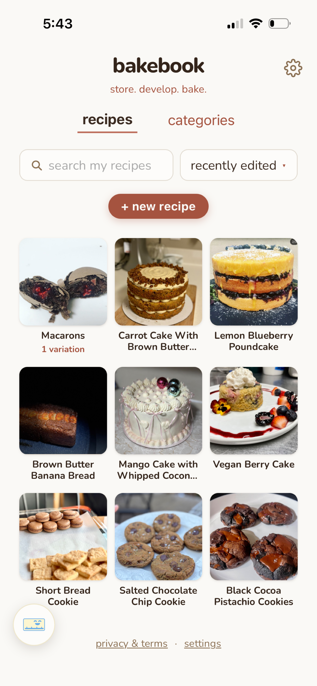
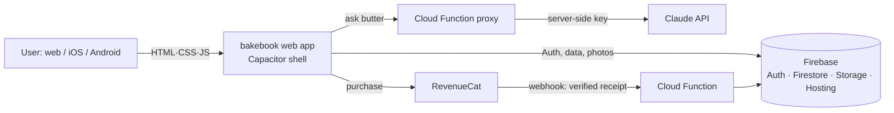

<div align="center">

# 🧈 bakebook

### A recipe **development & storage** app — store your recipes, then actually make them better.

**[▶ Live demo](https://bakebook-gz9v92.web.app)** &nbsp;·&nbsp; iOS (App Store — coming soon) &nbsp;·&nbsp; Android (in progress)

*Built solo, from idea to a live, full-stack, AI-powered app.*

</div>

---

## What it is

Most recipe apps are just cookbooks — a place to **store** recipes. bakebook adds the part
serious home bakers actually want: a place to **develop** them. Scale any recipe, track every
bake in a logbook, organize with categories, and work with **butter**, an AI baking assistant that
answers questions and can even edit a recipe with you — all while your originals stay safe.

> **"store. develop. bake."**

## ✨ Features

- **📖 Recipe library** — store, search, and organize recipes into categories (drag-to-file, rename, auto-dedupe).
- **🔬 Develop & iterate** — scale ingredients (1×/2×/custom, cups↔grams), spin off **variations** without touching the original, and break recipes into **components** (e.g. cake + frosting).
- **🧈 butter, the AI assistant** — chat about any recipe (substitutions, ratios, technique, troubleshooting); butter can propose and apply edits, powered by **Claude** via a secure server proxy (the API key never touches the client).
- **👩‍🍳 make-it mode** — a full-screen, step-by-step baking view with swipe/scrub navigation and per-step notes.
- **📓 Logbook** — record what you changed each bake and how it turned out.
- **☁️ Sync** — your recipes follow your account across devices.
- **💳 Subscriptions** — a free tier plus **bakebook+**, handled through RevenueCat + Apple.

## 📸 Screenshots

| butter chat | develop a recipe | make-it mode | library |
|---|---|---|---|
|  |  |  |  |

## 🏗️ Tech stack

| Layer | Tech |
|---|---|
| **Frontend** | Vanilla **HTML / CSS / JavaScript** (no framework — deliberate, for speed + full control) |
| **Mobile** | **Capacitor** (wraps the web app for iOS; Android in progress) |
| **Backend** | **Firebase** — Hosting, Auth, Firestore, Cloud Storage, Cloud Functions |
| **AI** | **Claude (Anthropic)** via a Cloud Function proxy (server-side key, content-safety checks) |
| **Payments** | **RevenueCat** (auto-renewing subscriptions, server-verified via webhook) |
| **Testing** | Custom **Playwright + WebKit** automated dev→test agent loop (see below) |

## 🔩 Architecture



The client never holds a secret: butter's requests go to a Cloud Function that attaches the
Anthropic key server-side, and premium status is flipped only by a RevenueCat webhook the browser
can read but never write — a single server-side source of truth.

## 🗂️ Repo layout

```
bakebook/          the web app (HTML/CSS/JS) — the whole client
functions/         Firebase Cloud Functions (the butter proxy + RevenueCat webhook)
firestore.rules    Firestore security rules
storage.rules      Cloud Storage security rules
firebase.json      Firebase Hosting + emulator config
capacitor.config.json   Capacitor (mobile wrapper) config
docs/screenshots/  app screenshots
```

## 🤖 Engineering highlight: an automated dev→test loop

Beyond the app, I built a small **request → spec → develop → test → sign-off** pipeline to ship
changes safely: a change request is turned into two independent specs, an isolated **development
agent** implements it on its own git branch, and an isolated **testing agent** drives the real UI
with **Playwright (WebKit — the same engine as iOS)** and returns an honest PASS/FAIL — the two never
share reasoning, so the verdict is a genuine independent check. It even taught me where automated
tests *can't* go (real-finger gesture "feel" is confirmed on a physical device).

## 🗺️ Roadmap

- [x] Live web app + iOS build
- [ ] App Store release
- [ ] Android (Google Play)
- [ ] Deeper recipe-development tooling

---

<div align="center">
Built by <b>Claire Mull</b> · <a href="https://bakebook-gz9v92.web.app">bakebook-gz9v92.web.app</a> · <a href="https://github.com/clairemullacelia">@clairemullacelia</a>
</div>
