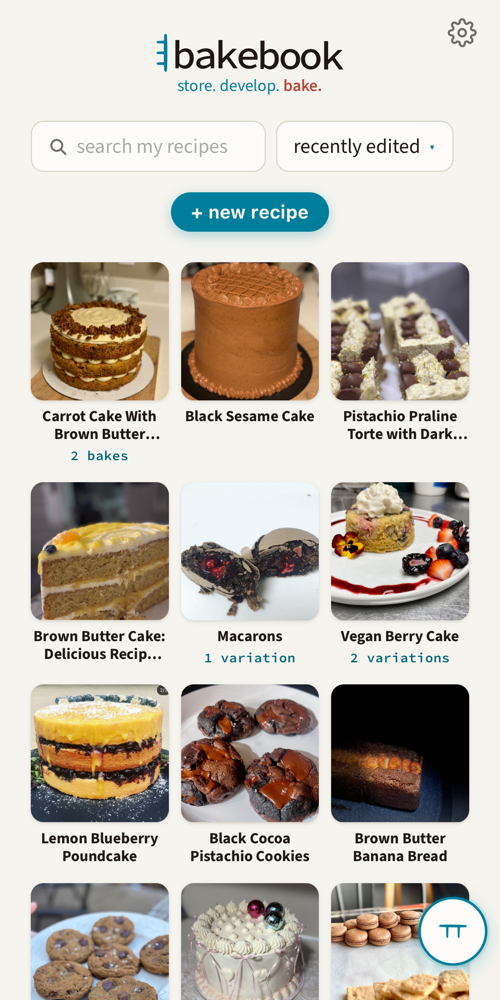
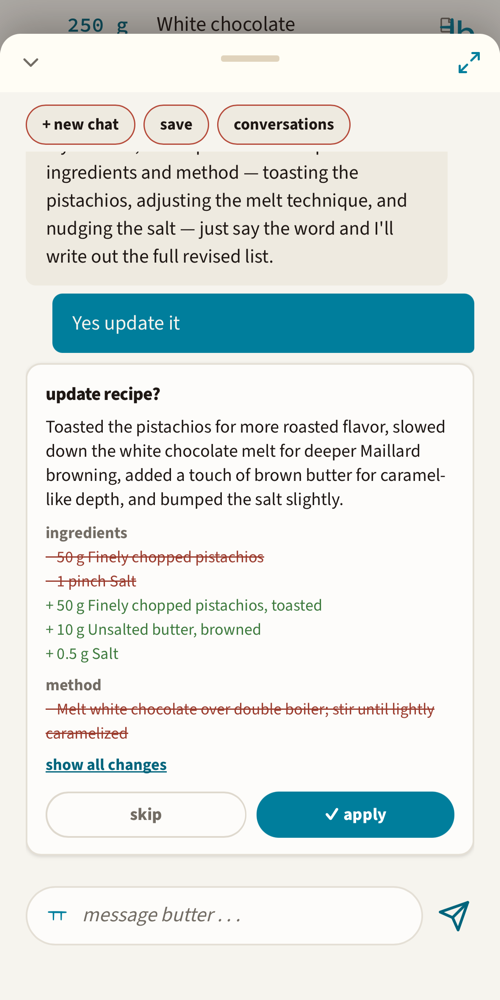
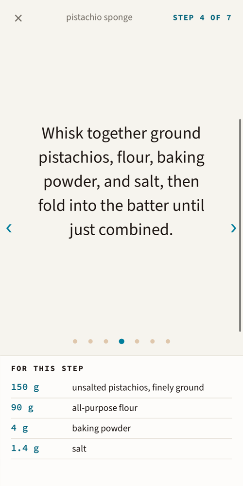
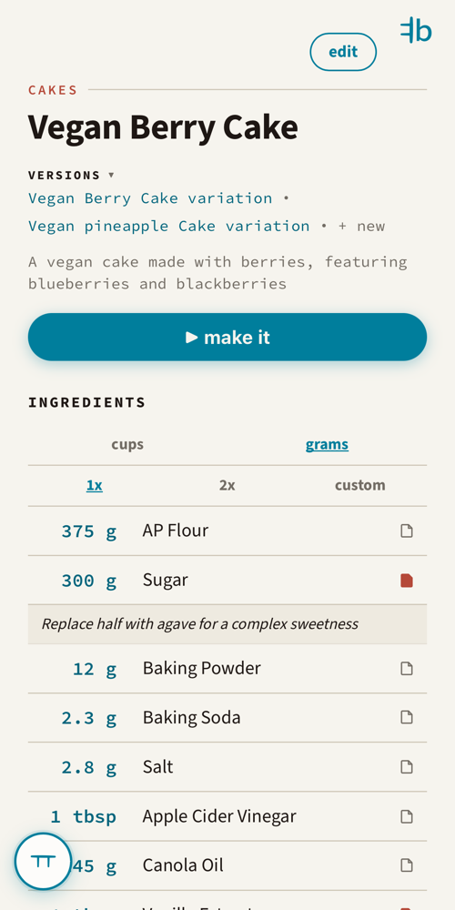
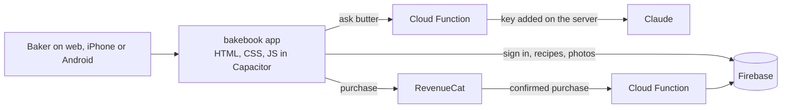

<div align="center">


**A recipe app for people who change their recipes.**

[App Store](https://apps.apple.com/us/app/bakebook-recipe-lab/id6791304387) · Google Play (rolling out) · [bakebook.co](https://bakebook.co)

</div>

## What it is

bakebook stores your recipes, then helps you develop them.

Most recipe apps stop at storage. Bakers who test and adjust need more. In bakebook you can
change a ratio, log how the bake came out, and build the next version on what the last one
taught you.

- **Store.** One list, or categories you name. Search, sort, and drag a recipe between categories.
- **Develop.** Split a recipe into parts (cake, frosting, filling). Scale to any yield. Switch
  between grams and cups. Save a variation as its own recipe, linked to the original.
- **Bake.** Make-it mode shows one step at a time, with only the ingredients that step uses.
- **Log.** Each bake gets a dated note: what changed, how it turned out, what to try next.
- **Ask butter.** butter is an AI baking assistant that has read the recipe on screen. It
  answers questions and proposes edits. You see every change before you apply it.
- **Import and share.** Paste a link or photograph a page to bring a recipe in. Send any recipe
  as a link that opens without an account.

bakebook is free, with an optional subscription (bakebook+) for more recipes and more butter.

## Status

| Platform | State |
|---|---|
| iOS | Live on the [App Store](https://apps.apple.com/us/app/bakebook-recipe-lab/id6791304387) since September 2026 |
| Android | Submitted to Google Play production, rolling out |
| Web | [bakebook.co](https://bakebook.co) |

## Screenshots

| Library | butter proposes an edit | Make-it mode | Versions and notes |
|---|---|---|---|
|  |  |  |  |

## Stack

| Layer | What it uses |
|---|---|
| App | Plain HTML, CSS and JavaScript. No framework. |
| Phone apps | Capacitor 8, which wraps the web app as a native iOS and Android app |
| Backend | Firebase: Hosting, Auth, Firestore (the database), Cloud Storage (photos), Cloud Functions (server code) |
| AI | Claude (Anthropic), reached only through a Cloud Function |
| Subscriptions | RevenueCat, on top of Apple and Google billing |
| Type and colour | Source Code Pro and Source Sans 3. Teal `#007E9C`, charcoal, cream. |

## How it is built

There are three layers.

1. **The app.** The pages in `bakebook/` are the whole app. The same files run on the web, on
   iPhone and on Android.
2. **The wrapper.** Capacitor packages those pages into a native app shell for each store.
3. **The backend.** Firebase holds accounts, recipes and photos, and runs the server code in
   `functions/`.


```mermaid
flowchart LR
  U[Baker on web, iPhone or Android] --> APP[bakebook app<br/>HTML, CSS, JS in Capacitor]
  APP -->|sign in, recipes, photos| FB[(Firebase)]
  APP -->|ask butter| CF[Cloud Function]
  CF -->|key added on the server| CL[Claude]
  APP -->|purchase| RC[RevenueCat]
  RC -->|confirmed purchase| CF2[Cloud Function] --> FB
```

A few decisions shape the code:

- **Offline first.** Every edit saves on the device first, then syncs to Firestore in the
  background (`bakebook-store.js`). The book stays usable with no signal. When two devices edit
  the same recipe, a merge step keeps each device's real changes and never drops a logged bake.
- **No secrets in the app.** The app never holds the Claude key. It asks a Cloud Function, which
  adds the key on the server, checks daily limits, and screens messages before the main model
  answers.
- **The server decides who has paid.** An account becomes bakebook+ only when RevenueCat confirms
  the purchase to a Cloud Function. The app can read that status but cannot write it.
- **Rules guard the data.** `firestore.rules` and `storage.rules` let each account read and
  write only its own recipes and photos. A shared recipe is readable by anyone with its link.

The Firebase and RevenueCat keys in this copy are placeholders (`YOUR_FIREBASE_WEB_API_KEY` and
similar). The real ones are public identifiers, but they belong to the live app.

## How I built it

I am a product designer. I built bakebook with Claude Code, Anthropic's coding tool that runs
in the terminal. I made the product and design calls, and directed and checked the work. Claude
Code wrote most of the code.

To ship changes safely I set up a test loop, run as a Claude Code command (`/bakeloop`):

1. **Request.** I describe the change. Claude asks questions until it is clear, then writes it
   down.
2. **Spec.** Claude writes two specs: one for the developer, one for the tester. I approve them.
3. **Dev.** A fresh developer agent builds the change on its own git branch.
4. **Test.** A separate testing agent runs the real app in Playwright with WebKit (the engine
   behind Safari on iPhone). It clicks through the change, takes screenshots, and writes a PASS
   or FAIL with evidence.
5. **Review.** A third agent reads the code change cold, without the developer's notes, and
   looks for what the tests would miss.
6. **Sign-off.** I check the result myself before it ships.

The agents share only the written specs and results, never each other's reasoning. A failed
test goes back to a new developer agent. Each run keeps its specs, screenshots and verdicts.
About 30 changes have gone through it so far, mostly sync, editing and make-it fixes.

It has limits. A simulated tap is not a finger, so a test can pass a gesture that feels wrong
on a real phone. Gesture and scroll fixes are confirmed on a device by hand.

## Repo layout

```
bakebook/              the app: every page, script, style and font
functions/             Cloud Functions: the Claude proxy, import, limits, purchases, account deletion
firestore.rules        who can read and write which records
storage.rules          who can read and write which photos
firebase.json          Firebase hosting and deploy settings
capacitor.config.json  Capacitor settings for the phone apps
screenshots/           the images above
```

This repo is a public copy for reading. The native iOS and Android projects, the test harness
and the signing setup live in a private repo.

---

Built by [Claire Mull](https://clairemull.com) · [@clairemullacelia](https://github.com/clairemullacelia)
